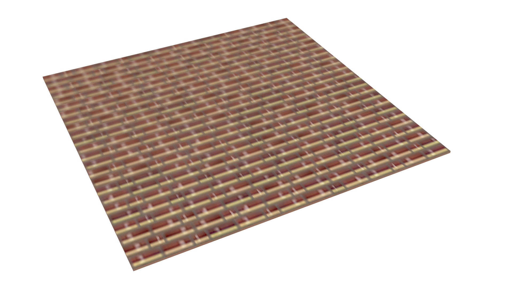
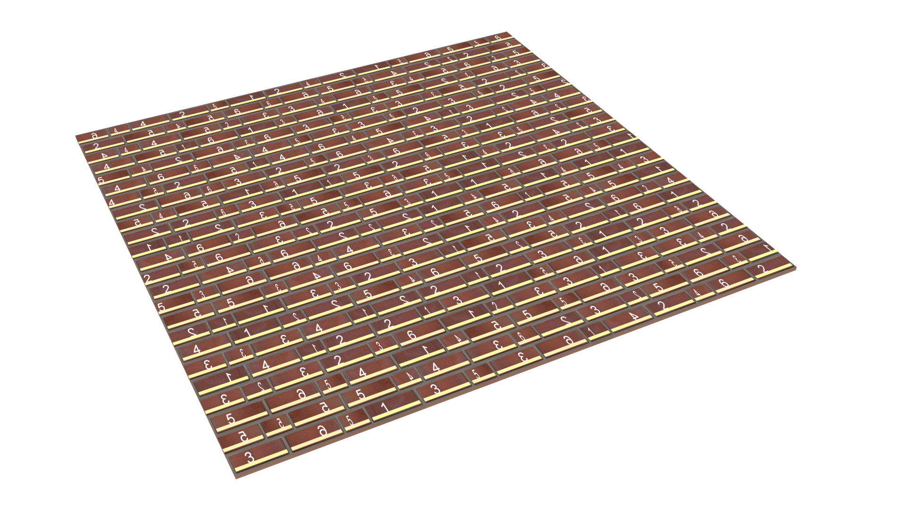
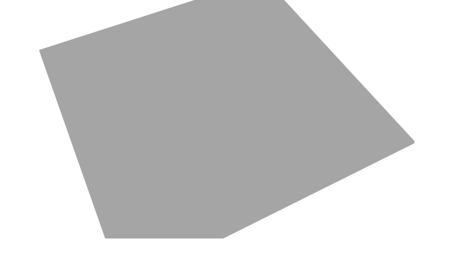

# BerconTile Bug Analysis

**Three documented bugs in VRay's BerconTile implementation — with root cause analysis, render proof, and fix recommendations for Chaos.**

| # | Bug | Renderer | Status |
|---|---|---|---|
| [#1](https://github.com/Alex-BB44/BerconTile-BlurFix/issues/2) | UV derivative mismatch → blurry tiles | CPU Standalone | ✓ Working fix provided |
| [#2](https://github.com/Alex-BB44/BerconTile-BlurFix/issues/1) | Random UV flip breaks normal maps | CPU Standalone | Workaround: disable flip |
| [#3](#gpu--no-texture-at-all) | No texture on GPU (CUDA/RTX) | GPU | On Chaos roadmap since 2022 |

All three share the same structural root in `BerconSC.h`: the wrapper overrides UV *position* (`UVW()`) but not the associated vector quantities (`DUVW`, `DPdUVW`, `BumpBasisVectors`).

---

## The Problem

### Setup (typical production use case)

```
VRayMtl
  └── Diffuse: TexBerconTile
        ├── Color 1: VRayMultiSubTex  (randomized by Tile ID)
        │     ├── Sub 0: VRayBitmap  ← brick_01.tx / brick_01.png
        │     ├── Sub 1: VRayBitmap  ← brick_02.tx / brick_02.png
        │     └── ...
        └── Color 2: grout color
```

### Observed behavior

| Renderer | Result |
|---|---|
| 3ds Max interactive viewport | Sharp — sharpening filters hide the issue |
| VRay Standalone CPU (`rtEngine=0`) | Correct tile randomization — **all sub-textures blurry** |
| VRay GPU CUDA (`rtEngine=5`) | **No texture at all — grey surface** |
| VRay GPU RTX (`rtEngine=7`) | **No texture at all — grey surface** |

### Render proof

| CPU default (blurry) | CPU fixed (sharp) |
|---|---|
|  |  |

| GPU CUDA (`rtEngine=5`) | GPU RTX (`rtEngine=7`) |
|---|---|
|  |  |

---

## Root Cause

### CPU Blur — UV derivative bug in `BerconSC.h`

BerconTile internally creates a `BerconSC` wrapper around the render context.  
It overrides `UVW()` to return tile-local UV coordinates — but **`DUVW()` is never overridden:**

```cpp
// BerconSC.h (Apache 2.0, github.com/Bercon/BerconMaps)

Point3 UVW(int channel)  { return uvPoint; }          // ✓ tile-local UV
Point3 DUVW(int channel) { return sc->DUVW(channel); } // ✗ BUG: original derivatives!
void DPdUVW(Point3 dP[3], int channel) { sc->DPdUVW(dP, channel); } // ✗ also unchanged
```

**Effect:** The MIP sampler receives UV derivatives that correspond to the *whole object*, not the individual tile. The derivatives are approximately `tile_width / tile_size` times too large → the sampler selects a too-coarse MIP level → blur.

**In 3ds Max:** Hidden by the interactive viewport's post-sharpening. Not visible until you render via VRay Standalone or export a `.vrscene`.

### GPU — explicit unsupported feature

VRay Standalone 7 issues these warnings for both CUDA and RTX:

```
Bercon tile UV mapping is unsupported, used in texture "Map__1@tex_0"
Bercon tile randomization is unsupported, used in texture "Map__1@tex_0"
```

The plugin is silently replaced by a default grey material. No crash, no visible error in the viewport — the render just comes back grey.

---

## The Fix (CPU Standalone)

The fix strategy depends on the texture format:

| Format | Has MIP pyramid | Fix | Value |
|---|---|---|---|
| `.tx` (maketx/tiled OpenEXR) | **Yes** | `UVWGenChannel.duvw_scale` | `= tile_size / tile_width` |
| `.png` / `.jpg` / `.exr` flat | No | `BitmapBuffer.filter_blur` | `= 0.01` |

### Primary fix for `.tx` — `duvw_scale`

Set `duvw_scale` on the `UVWGenChannel` of each sub-texture's bitmap:

```
duvw_scale = tile_size / tile_width
```

Example: `tile_size=1.0`, `tile_width=25.0` → `duvw_scale = 0.04`

This corrects the derivatives at the sampler input. VRay then selects the correct MIP level from the `.tx` pyramid. Clean result — no aliasing, no over-sharpening.

### Fallback fix for `.png` / `.jpg` — `filter_blur`

```
filter_blur = 0.01   (default: 1.0)
```

Suppresses the EWA over-softening pass. Since flat images have no embedded MIP pyramid, VRay generates MIPs in RAM — `filter_blur` doesn't change which MIP level is selected, only the post-filter.

### In `.vrscene` format

```
UVWGenChannel brick_uvw {
  uvw_channel=1;
  duvw_scale=0.04;   // FIX: tile_size / tile_width
}

BitmapBuffer brick_buf {
  file="resources/BK1a__01_diffuse.tx";
  // filter_blur=0.01;  // alternative fix for .png/.jpg
}
```

---

## AppSDK Code Example

Corrected snippet for the full BerconTile + TexMulti + BitmapBuffer chain,  
with format-aware fix (`.tx` → `duvw_scale`, `.png` → `filter_blur`):

```python
TILE_SIZE  = 1.0
TILE_WIDTH = 25.0
DUVW_SCALE = TILE_SIZE / TILE_WIDTH  # = 0.04

def make_bitmap(renderer, filepath):
    is_tx = filepath.lower().endswith('.tx')

    buf = renderer.classes.BitmapBuffer()
    buf.file = filepath
    if not is_tx:
        buf.filter_blur = 0.01   # fallback fix for flat textures

    uvwgen = renderer.classes.UVWGenChannel()
    uvwgen.uvw_channel = 0
    if is_tx:
        uvwgen.duvw_scale = DUVW_SCALE  # primary fix: corrects MIP derivatives

    bitmap = renderer.classes.TexBitmap()
    bitmap.bitmap = buf
    bitmap.uvwgen = uvwgen
    return bitmap

# TexMulti (mode=12, random_mode=132 for BerconTile randomization)
multi = renderer.classes.TexMulti()
multi.mode = 12
multi.random_mode = 132

tex_list    = vray.PluginList()
weight_list = vray.FloatList()
for path in TILE_TEXTURES:
    tex_list.append(make_bitmap(renderer, path))
    weight_list.append(1.0)

multi.textures_list  = tex_list
multi.random_weights = weight_list

# BerconTile
tile = renderer.classes.TexBerconTile()
tile.noise_map1  = multi
tile.tile_size   = TILE_SIZE
tile.tile_width  = TILE_WIDTH
```

Full working example: [`src/test_blur_fix.py`](src/test_blur_fix.py)

---

## Using the Fix Tool

`src/test_blur_fix.py` patches existing `.vrscene` files automatically:

```bash
# Analyze a scene
python test_blur_fix.py scene.vrscene --analyze

# Apply fix and render comparison
python test_blur_fix.py scene.vrscene --fix --render

# Render 4 blur levels for comparison
python test_blur_fix.py scene.vrscene --compare

# Render with specific blur value
python test_blur_fix.py scene.vrscene --blur 0.01 --render
```

The tool auto-detects `.tx` vs `.png` format per `BitmapBuffer` and applies the correct fix.  
It also auto-calculates `duvw_scale` from the `TexBerconTile` parameters in the scene.

**Requirements:**
- Python 3.8+
- VRay AppSDK (optional — tool works as text patcher without it)
- Linux: `LD_LIBRARY_PATH=/usr/Chaos/V-Ray/AppSDK/bin`

---

## Demo Scene

`resources/` contains 6 brick texture pairs (`.png` + `.tx`) — free to use (CC0).

To build the demo `.vrscene`:

```bash
python3 src/build_demo_scene.py \
  --resources resources/ \
  --out scene/
```

Renders with VRay Standalone:

```bash
# Default (blurry)
vray -sceneFile=scene/demo.vrscene -imgFile=output/default.png -imgWidth=1920 -imgHeight=540

# With fix applied (sharp)
python3 src/test_blur_fix.py scene/demo.vrscene --fix --render --out output/
```

---

## GPU Status

**TexBerconTile is not supported on VRay GPU (CUDA or RTX).**

Tested on VRay Standalone 7 with NVIDIA GeForce RTX 3070:

```
vray -sceneFile=demo.vrscene -rtEngine=5   # CUDA → grey
vray -sceneFile=demo.vrscene -rtEngine=7   # RTX  → grey
```

VRay issues explicit warnings:
```
Bercon tile UV mapping is unsupported
Bercon tile randomization is unsupported  
```

The GPU renderer silently replaces BerconTile with a default grey material — no crash, no error code.  
This is an unimplemented feature, not a configuration issue.

**This has been on Chaos' GPU roadmap as "high priority" since September 2022.**  
As of VRay 7 (2025) it remains unimplemented.

---

## Bug #2: Random UV Flip Breaks Normal Maps

### Problem

BerconTile applies random per-tile UV mirroring to add variation:
```
U_new = 1.0 - U_old   (horizontal flip)
V_new = 1.0 - V_old   (vertical flip)
```

For **diffuse/color textures** this is correct — mirroring is purely visual.

For **tangent-space normal maps**, the X channel (red) encodes the surface normal direction *along the U axis*. Mirroring U without negating the X component means the tangent vector points the wrong way → light appears to come from the opposite side, edges look inverted. Tiles with a flip applied will have visibly inconsistent shading compared to non-flipped neighbors.

The same applies to rotations of 90°/270° (which imply a flip of the tangent basis).

### Root cause — same structural issue as Bug #1

In `BerconSC.h`, the UV flip is applied to the coordinate but the tangent basis is never updated:

```cpp
// UV position: flipped correctly
Point3 UVW(int channel)  { return uvPoint; }  // tile-local, flipped

// Tangent basis: unchanged — WRONG for flipped normal maps
void DPdUVW(Point3 dP[3], int channel){ sc->DPdUVW(dP, channel); }
int BumpBasisVectors(Point3 dP[2], int axis, int channel){
    return sc->BumpBasisVectors(dP, axis, channel);
}
```

### Fix (for Chaos to implement)

**Option A — Safe, simple:** Add parameter `normal_map_mode = 0/1`.  
When enabled: skip `flip_X`/`flip_Y` and flip-inducing rotations entirely.

**Option B — Correct, complete:** When U-flip was applied, negate the tangent X component in `BumpBasisVectors()` / `DPdUVW()`. When V-flip was applied, negate the bitangent Y component.

Option B preserves the flip feature for normal maps with correct shading. Option A is simpler and safe for most use cases.

### Workaround (today)

Disable `flip_X` and `flip_Y` on the TexBerconTile node when using it in a normal map slot. This eliminates the artifact at the cost of tile variation.

---

## For Chaos Developers

The `BerconMaps` source code is publicly available under **Apache 2.0**:  
https://github.com/Bercon/BerconMaps

The tile geometry algorithm lives in `src/tile.cpp` — pure math, no 3ds Max dependencies,  
GPU-portable — the algorithm could be implemented as a CUDA kernel by Chaos (no public GPU plugin API exists for third parties). The fix for the CPU blur bug requires:

1. Override `DUVW()` in `BerconSC` to scale derivatives by `tile_size / tile_width`
2. Override `DPdUVW()` accordingly

Or equivalently expose `duvw_scale` as a documented parameter on `UVWGenChannel`  
(it already exists in the VRay AppSDK — this repository demonstrates its use).

For GPU support, the `Tile::draw()` function in `tile.cpp` needs a CUDA implementation  
that outputs both tile-local UV coordinates and a tile ID for sub-texture randomization.

**Bug #2 (normal map flip):** The fix is equally contained — `BerconSC::BumpBasisVectors()` and `DPdUVW()` need to negate the appropriate axis when a UV flip was applied. All three bugs share the same root: `BerconSC` overrides `UVW()` but not the associated vector/derivative quantities. A single consistent review of `BerconSC.h` would address all of them.

---

## Environment

Tested on:
- VRay Standalone 7.30.03 (Linux RHEL8)
- VRay AppSDK 7 (Python 3.12)
- NVIDIA GeForce RTX 3070 (8 GB VRAM)
- Python 3.12 / Pillow 10.2

---

## License

- Fix tool (`src/`) — MIT License
- Demo textures (`resources/`) — CC0 (public domain)
- BerconMaps source references — Apache 2.0 (Jerry Ylilammi / github.com/Bercon/BerconMaps)
